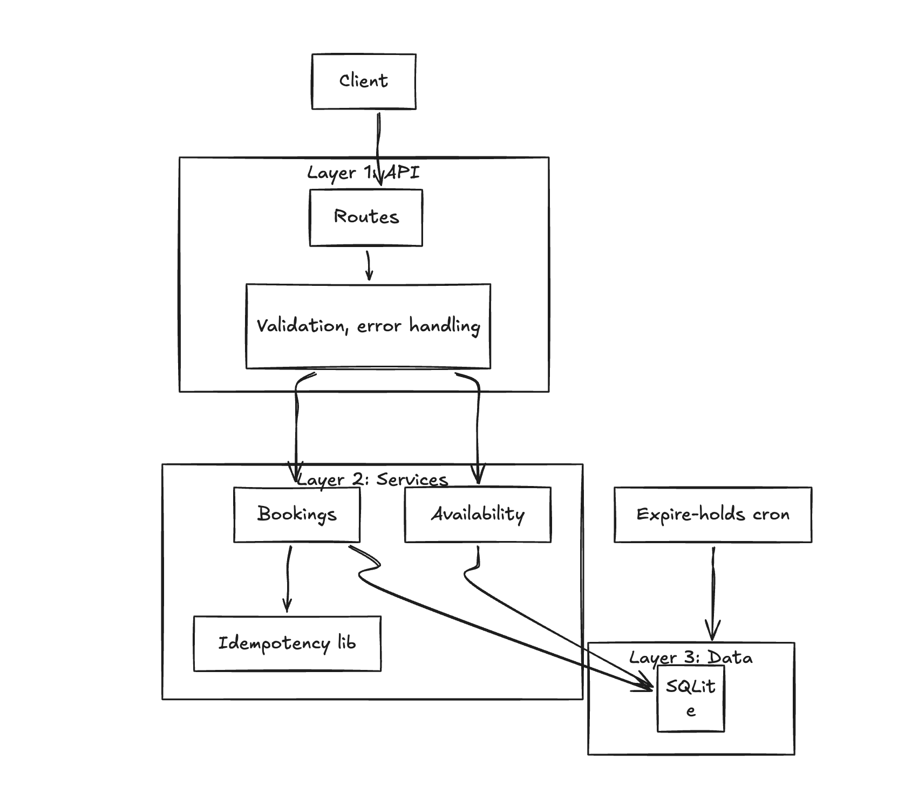

# Lifted — Immigration Advisor Booking API

Small API for managing advisor availability and bookings (hold/confirm). Built for the Lifted take-home task.

**Why a server?** In an ideal world this would be serverless (AWS Lambda + API Gateway + EventBridge for cron). The workload doesn’t need a long-running process — each request is short-lived and the expire-holds job could run as a scheduled Lambda. For ease of running locally and demoing, this repo uses a single Express server and node-cron.

---

## How to run

```bash
npm install
npm run dev
```

- Server on `http://localhost:3000` (override with `PORT`).
- DB at `bookings.db`; created and seeded on first run when empty (two advisors, Sofia and Rajan, with March 2025 availability from `data/seed.json`). Reset: `npm run db:reset`, then start again.

**Environment:** `PORT`, `NODE_ENV`, `LOG_LEVEL`. Copy `.env.example` to `.env` to override defaults.

### Endpoints

| Method | Path                           | Description                                             |
| ------ | ------------------------------ | ------------------------------------------------------- |
| GET    | `/health`                      | Liveness                                                |
| GET    | `/health/db`                   | DB connectivity                                         |
| GET    | `/api/v1/availability`         | Bookable slots (query: `visaType`, `advisorId`, `date`) |
| POST   | `/api/v1/bookings`             | Create booking; optional `Idempotency-Key` header       |
| POST   | `/api/v1/bookings/:id/confirm` | Confirm held booking                                    |
| GET    | `/api/v1/bookings`             | List bookings (query: `status`, `advisorId`, `date`)    |

A **Postman collection** is included: import `postman/Lifted Booking API.postman_collection.json` and set the `baseUrl` variable to `http://localhost:3000`.

---

## Architecture

Three layers: API → services → data. Cron runs alongside the server for expire-holds; in production that would be EventBridge → Lambda.



**Deliberately skipped (for the demo):** Auth, rate limiting, request signing. In production these would sit behind API Gateway (or similar) before traffic reaches this logic.

---

## Tech choices

- **Express 5** - HTTP API; minimal surface.
- **TypeScript** — types and maintainability.
- **Drizzle + SQLite** — schema in code, migrations, simple local run; swap to Postgres in production. SQL was a deliberate choice for the data model: ACID for booking transactions, predictable concurrency (and later `SELECT FOR UPDATE` in prod), and referential integrity (advisors, windows, bookings, waitlist) instead of eventually-consistent or document-shaped data.
- **Zod** — request validation and env parsing.
- **Pino** — structured logging.
- **Vitest** — unit tests with in-memory SQLite.

### Database

SQLite here; Postgres in production. **Locking:** SQLite gives single-writer serialisation, so create-booking’s single transaction (check slot, insert, store idempotency) is atomic and you don’t get two bookings on the same slot. In production I’d use Postgres and explicit row/slot locking (e.g. `SELECT FOR UPDATE`) so I stay correct with concurrent writers. **Optimistic locking:** confirm-booking uses a `version` column on bookings—read then update with `WHERE id = ? AND version = ?` and bump version; if the row changed in between, the update affects zero rows and I reject (avoids lost updates if two confirms race). **Referential integrity** via FKs (advisors → windows, bookings; bookings referenced by waitlist). WAL mode for better concurrent read behaviour. **Indexes:** none beyond primary keys in this demo (I dropped the unique on `(advisorId, startTime)` so expired slots can be rebooked). In production I'd add indexes on hot paths (e.g. `bookings(status, holdExpiresAt)` for the expire-holds job). No pagination or caching here; I'd add both when needed.

---

## Security (in place)

Helmet and CORS are on; request body size is bounded by Express. No auth, rate limiting, or request signing in this repo — those would live at API Gateway (or similar) in front of the app.

---

## Assumptions I made

- Single instance for the demo; no cross-process locking.
- All times UTC; seed and request payloads use ISO strings.
- `candidateName` is not an authenticated identity; no “one booking per user” enforcement.
- Availability is whatever’s in the DB (seed or future ingestion); I don’t validate slot start is in the future.
- No cancellation or no-show flow; confirmed bookings are final for this scope.
- Hold window (10 min), break buffers (5/10 min), and visa durations (30/60 min) are fixed per spec; not configurable.
- Confirm is done by anyone with the booking ID; I didn’t add advisor auth.
- Idempotency keys are stored indefinitely in this demo (no TTL).

---

## Logic in brief

- **Availability:** Cursor-based sweep over windows by slot duration; held/confirmed block slots; break buffers (5 min after Type A, 10 min after Type B) after confirmed only; optional filters and grouping by date. So the algorithm never returns a slot that would sit inside a buffer—only slots that are actually bookable.
- **Bookings:** Create runs in one transaction (idempotency check, window fit, no conflict, no buffer violation, insert held, store idempotency key). Create also checks buffer violation (so if someone POSTs a slot that wasn’t from availability, I reject it). Confirm: find held, reject if expired or not held, update to confirmed with version bump. Expired holds are ignored when deciding if a slot is free (so slots are rebookable as soon as time passes); the cron then sets `status = expired` in the DB so data stays accurate.

---

## Challenges and trade-offs

- **Concurrency:** SQLite is synchronous; requests are serialised. Production: Postgres and `SELECT FOR UPDATE` around slot checks.
- **Pagination & caching:** Not in scope here; both are things I'd add once listing and availability traffic justify it.
- **Idempotency:** Implemented for `POST /bookings` only; keys stored in DB. Production: expire keys (e.g. 24h); could use Redis for faster lookups.
- **Dates:** I don't reject past slot starts (keeps the demo simple with fixed seed data). Production: only allow forward booking; validate slot start is in the future; one booking per user per day if needed; no-shows and reminders (e.g. notifications) would build on this.
- **No per-candidate limit:** Same name can create multiple bookings. Production: auth and enforce one active booking per user (or your rule).
- **Waitlist:** The table exists in the schema (ready for `addToWaitlist`, `processWaitlist`, etc.) but I didn't get around to implementing the logic. Would wire it to expire-holds (or an event) and use SQS in production.

This has solid foundations for an event-driven setup (e.g. hold-expired and booking-confirmed as events, at-least-once delivery, idempotent handlers).

**Scalability:** This demo is single-instance with SQLite. If I went serverless (Lambda + API Gateway), scaling is automatic—no load balancers or auto-scaling groups to manage. I'd still move to Postgres (and proper row locking) for concurrent writers, and run expire-holds as a scheduled Lambda. If I kept a long-running server instead, then I'd add a load balancer and multiple instances. Read-heavy endpoints (e.g. availability) could use read replicas or caching once traffic justifies it.

**With more time I'd also consider:** cancellation flows (and pushing freed slots to the waitlist), monitoring/observability, more extensive testing (integration + E2E), real-time updates via WebSockets so the IA dashboard reflects holds and confirms as they happen, and email notification flows (hold confirmed, reminder, no-show). For the waitlist, SQS would fit nicely, publish when a hold expires, consumer picks up and offers to the next in queue.

---

## Tests

```bash
npm test
```

Unit tests cover availability and bookings.
